# AI Donation Matcher Final Documentation

Last updated: 2026-03-31

## 1. Executive Summary

AI Donation Matcher is a location-aware donation coordination platform that connects donors with verified NGOs based on real-time needs. The deployed system now uses:

- React 19 + Vite 6 frontend
- Spring Boot backend
- PostgreSQL persistence
- Firebase Authentication for client sign-in
- Render for backend hosting
- Vercel for frontend hosting
- OpenStreetMap + Leaflet for map rendering
- OSRM for route estimation
- Nominatim for address geocoding when needed

The platform supports three application roles:

- `DONOR`
- `NGO`
- `ADMIN`

Firebase now owns user authentication at the identity layer, while the backend still owns:

- application role assignment
- NGO approval state
- profile completion state
- need and pledge lifecycle
- moderation and admin authorization

## 2. System Architecture

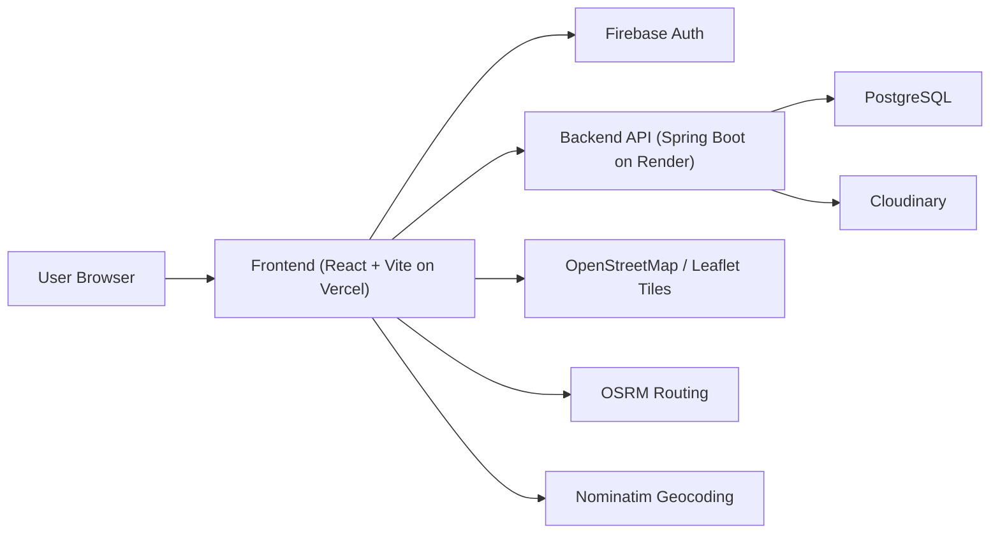

### 2.1 Deployment Topology

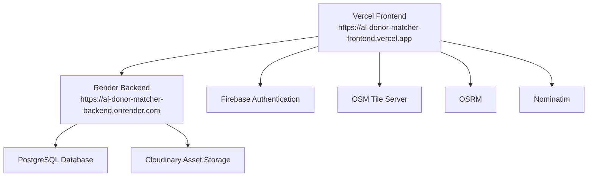

## 3. Core Data Model

### 3.1 ER Diagram

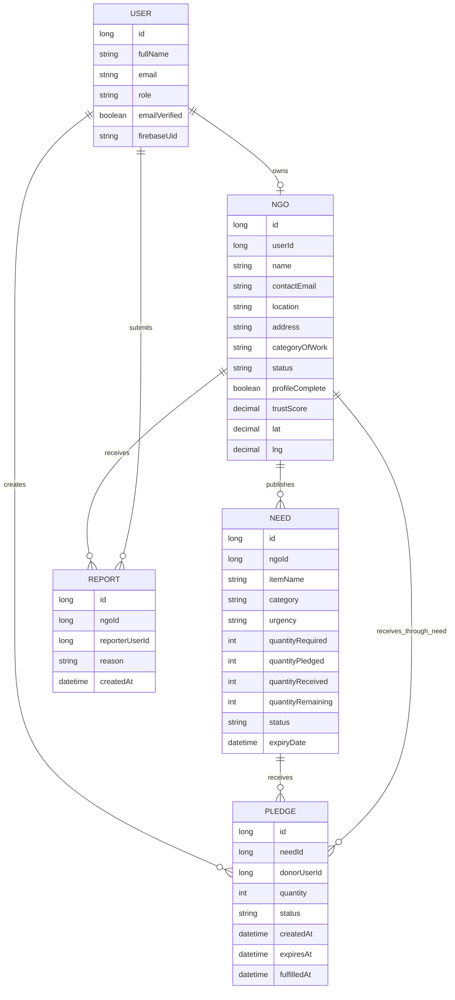

### 3.2 Practical Ownership Rules

- Every `NGO` record belongs to one `USER`.
- Every `NEED` belongs to one NGO.
- Every `PLEDGE` belongs to one donor user and one need.
- Need remaining quantity is now a derived operational value driven by pledged and received totals.
- NGO receipt is now pledge-level, not only need-level.

## 4. Authentication and Authorization Flow

### 4.1 Firebase + Backend Hybrid Model

The current authentication stack is hybrid:

1. Frontend signs users in with Firebase Email/Password.
2. Frontend reads the Firebase ID token.
3. Frontend calls backend registration/login using that token.
4. Backend validates the Firebase token and maps it to the application user model.
5. Backend APIs trust the Firebase bearer token for protected requests.

### 4.2 Login / Signup Sequence

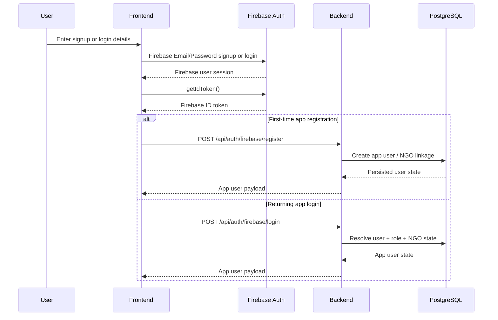

### 4.3 Auth Responsibilities

#### Firebase owns

- email/password sign-in
- email verification email delivery
- Firebase session state
- ID token issuance

#### Backend owns

- `DONOR` / `NGO` / `ADMIN` role
- NGO approval and suspension
- profile completion gating
- protected app business rules

## 5. Route Map

The active route set is:

- `/login`
- `/register`
- `/verify-email`
- `/`
- `/map` -> redirects to `/`
- `/ngo/:ngoId`
- `/pledge/:needId`
- `/delivery/:pledgeId`
- `/donor/dashboard`
- `/ngo/dashboard`
- `/ngo/complete-profile`
- `/admin/dashboard`

## 6. End-to-End Feature Flows

### 6.1 Donor Discovery Flow

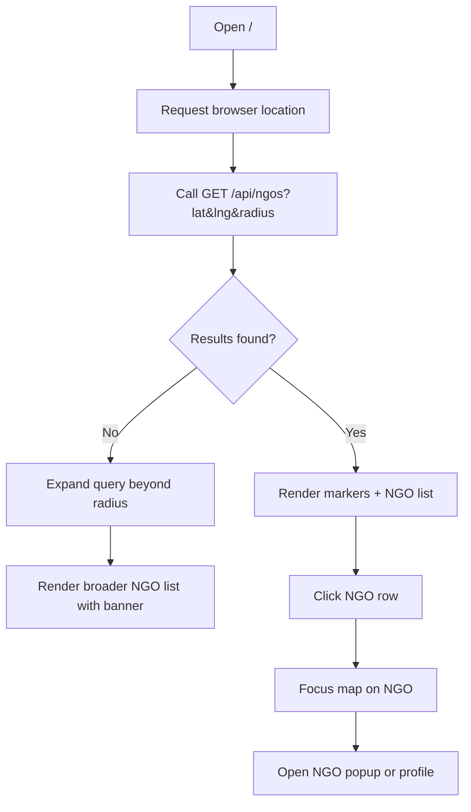

Current donor home also surfaces a small active pledge banner using `GET /api/pledges/active`.

### 6.2 Donor Pledge Creation Flow

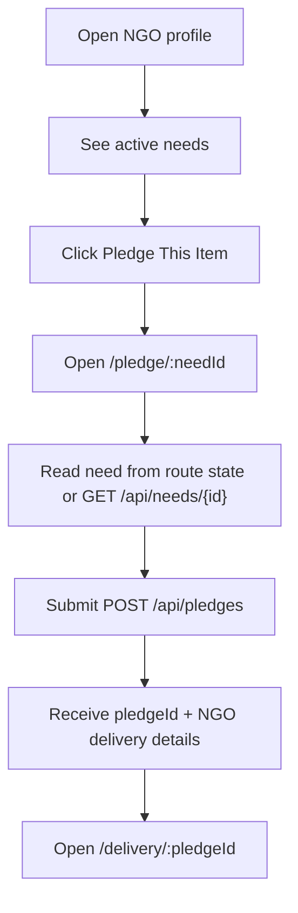

### 6.3 Delivery Flow

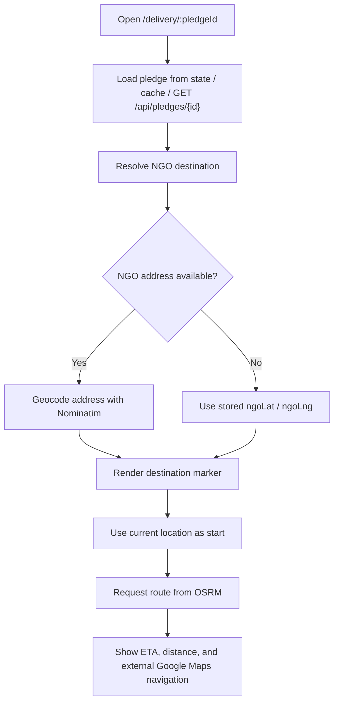

### 6.4 Donor Dashboard Flow

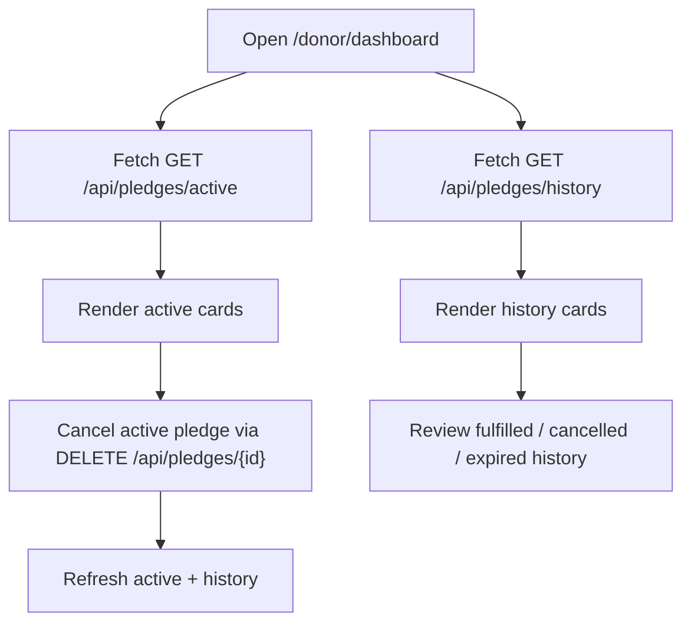

If active count is zero and history exists, the frontend auto-switches to the history tab.

### 6.5 NGO Need Management Flow

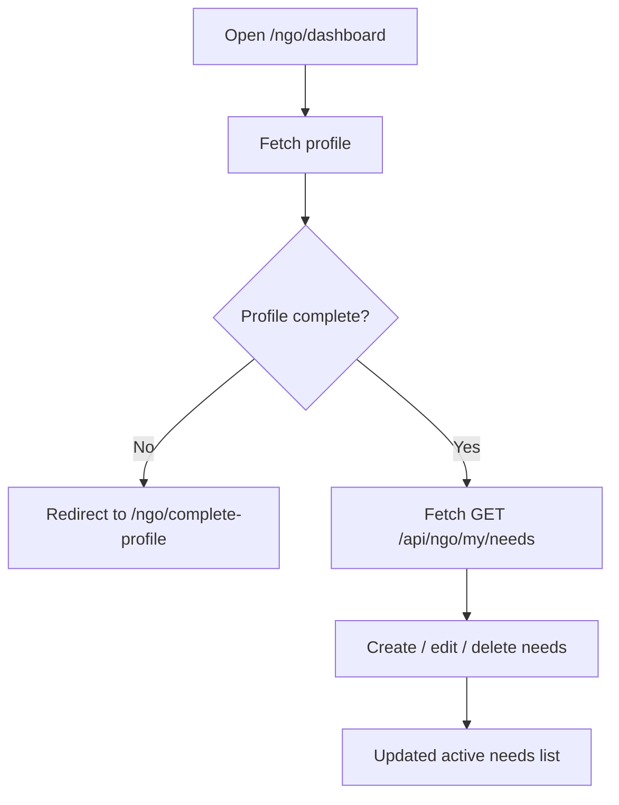

### 6.6 NGO Incoming Pledge Receipt Flow

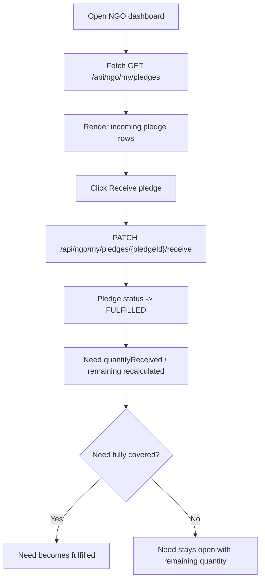

This is the major behavior change from the older need-level-only fulfillment model.

### 6.7 Admin Approval Flow

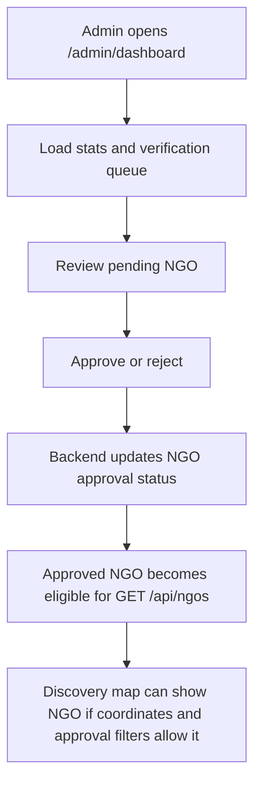

## 7. API Surface Used by Frontend

### 7.1 Public / shared

- `POST /api/auth/firebase/register`
- `POST /api/auth/firebase/login`
- `GET /api/ngos`
- `GET /api/ngos/{id}`
- `GET /api/needs/{id}`

### 7.2 Donor

- `POST /api/pledges`
- `GET /api/pledges/active`
- `GET /api/pledges/history`
- `GET /api/pledges/{id}`
- `DELETE /api/pledges/{id}`
- `POST /api/ngos/{id}/report`

### 7.3 NGO

- `GET /api/ngo/my/profile`
- `PUT /api/ngo/my/profile`
- `POST /api/ngo/my/photo`
- `GET /api/ngo/my/needs`
- `POST /api/needs`
- `PUT /api/needs/{id}`
- `DELETE /api/needs/{id}`
- `GET /api/ngo/my/pledges`
- `PATCH /api/ngo/my/pledges/{pledgeId}/receive`

### 7.4 Admin

- `GET /api/admin/stats`
- `GET /api/admin/ngos/pending`
- `POST /api/admin/ngos/{id}/approve`
- `POST /api/admin/ngos/{id}/reject`
- `GET /api/admin/reports`
- `GET /api/admin/ngos`
- `GET /api/admin/ngos/{id}/needs`
- `POST /api/admin/ngos/{id}/suspend`

## 8. Database Access Patterns

### 8.1 Login / Signup

- Firebase stores the identity record.
- Backend stores and reads the application user record and NGO linkage record.

### 8.2 Need Access

- Discovery map reads NGO summaries from backend, which are filtered for public visibility.
- NGO dashboard reads own needs directly.
- Admin dashboard reads moderated NGO and need views.

### 8.3 Pledge Access

- Donor active/history endpoints are donor-scoped.
- NGO incoming pledge list is NGO-scoped.
- Admin does not manage donor pledge lifecycle directly in the current frontend flow.

### 8.4 Geospatial Access

- Backend stores NGO coordinates.
- Frontend uses those coordinates for map pinning.
- Delivery page can re-geocode NGO address when route accuracy matters.

## 9. Deployment and Environment

### 9.1 Frontend Environment Variables

Required frontend variables:

```text
VITE_API_BASE_URL=https://ai-donor-matcher-backend.onrender.com
VITE_FIREBASE_API_KEY=...
VITE_FIREBASE_AUTH_DOMAIN=ngo-donation-matcher.firebaseapp.com
VITE_FIREBASE_PROJECT_ID=ngo-donation-matcher
VITE_FIREBASE_STORAGE_BUCKET=ngo-donation-matcher.firebasestorage.app
VITE_FIREBASE_MESSAGING_SENDER_ID=997805461490
VITE_FIREBASE_APP_ID=1:997805461490:web:7d74b8bc7f4cfd0830e56b
VITE_OSRM_URL=https://router.project-osrm.org
VITE_NOMINATIM_URL=https://nominatim.openstreetmap.org
```

### 9.2 Production URLs

- Frontend: `https://ai-donor-matcher-frontend.vercel.app`
- Backend: `https://ai-donor-matcher-backend.onrender.com`

### 9.3 Required Cross-System Configuration

Backend CORS must allow:

- `http://localhost:5173`
- `https://ai-donor-matcher-frontend.vercel.app`

Firebase authorized domains must include:

- `ai-donor-matcher-frontend.vercel.app`

## 10. Current Constraints and Known Gaps

- Admin report dismissal / resolution is not yet part of the supported frontend workflow unless backend adds it explicitly.
- NGO reinstate / unsuspend is not yet supported unless backend adds it explicitly.
- Newly approved NGOs appear on the map only if backend includes them in `GET /api/ngos` and valid coordinates exist.
- The frontend still depends on backend consistency between need state and donor history state for completed or cancelled pledge visibility.

## 11. Validation Checklist

### Auth

- Firebase signup works
- Firebase login works
- backend register/login with bearer token works
- unverified users are gated correctly

### Discovery

- donor home loads nearby NGOs
- list click focuses map
- `View full profile` opens NGO page

### Pledges

- donor can pledge a need
- delivery page loads after refresh
- Google Maps navigation uses NGO address first
- donor cancellation updates dashboard state

### NGO

- NGO profile completion flow works
- active needs CRUD works
- incoming pledge receipt works pledge-by-pledge

### Admin

- approve/reject queue works
- approved NGOs become discoverable when backend returns them

## 12. Source of Truth

When this document conflicts with older implementation notes, the current source of truth is:

1. current code in the frontend repo
2. [FRONTEND_BACKEND_AGREEMENT.md](C:\Users\moham\FYP\AI-Donor-Matcher-Frontend\docs\FRONTEND_BACKEND_AGREEMENT.md)
3. current backend Swagger / deployed contract
